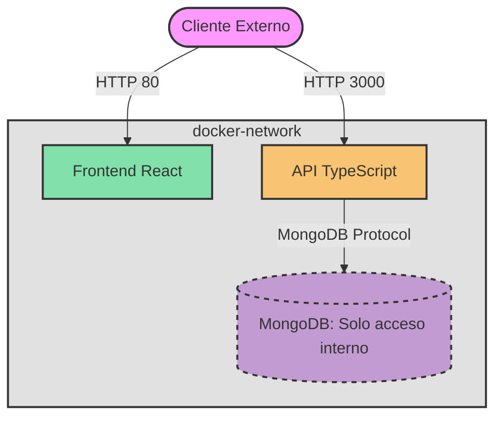

# Docker Examples Collection

Este repositorio contiene una colección de ejemplos prácticos de Docker y Docker Compose, desde aplicaciones simples hasta configuraciones más complejas con múltiples servicios.

## Estructura del Proyecto

```
EA-Docker/
├── simpleAPI/          # API REST en TypeScript
└── simpleReactApp/     # Frontend en React
```

## Arquitectura del Proyecto Principal

El proyecto principal utiliza una arquitectura de microservicios con:
- Frontend en React
- API REST en TypeScript
- Base de datos MongoDB
- Acceso directo a los servicios



### Red Docker
- `backend-network`: Red donde se encuentran todos los servicios
  - MongoDB solo es accesible internamente a través de `expose`
  - Frontend y API son accesibles externamente a través de `ports`

## Ejecución del Proyecto Principal

Para ejecutar la aplicación completa:

```bash
docker-compose up --build
```

Esto iniciará:
- Frontend en http://localhost:80
- API accesible en http://localhost:3000
- MongoDB (no accesible desde exterior)

## Ejemplos Individuales


### 1. Simple API (TypeScript)
Una API REST que mantiene un contador de hits usando MongoDB.

```bash
cd simpleAPI
docker build -t simple-api .
docker run -p 3000:3000 simple-api
```
Accede a http://localhost:3000/counter para ver el contador incremental.

### 2. Simple React App
Frontend en React que consume la API de números aleatorios.

```bash
cd simpleReactApp
docker build -t simple-react .
docker run -p 3001:3000 simple-react
```
Accede a http://localhost:80

### 3. Aplicación Completa (API + Frontend + MongoDB)
Ejecuta la API, MongoDB y el frontend juntos usando Docker Compose:

```bash
docker-compose up --build
```

## Requisitos

- Docker
- Docker Compose (v2.0.0+)
- Git (opcional)

# Alternativas para incluir el código fuente en una imagen Docker

Existen varias formas de incluir el código fuente en una imagen Docker:

1. **Copiar desde el contexto local**
   ```dockerfile
   COPY . /app
   ```
   Copia los archivos desde el directorio de construcción local.

2. **Descargar de una URL**
   ```dockerfile
   ADD https://example.com/archivo.tar.gz /app/
   ```
   Descarga y descomprime automáticamente archivos remotos.

3. **Clonar desde Git**
   ```dockerfile
   RUN git clone https://github.com/usuario/repo.git /app
   ```
   Clona directamente desde un repositorio Git durante la construcción.

